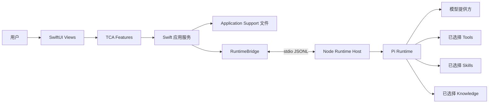
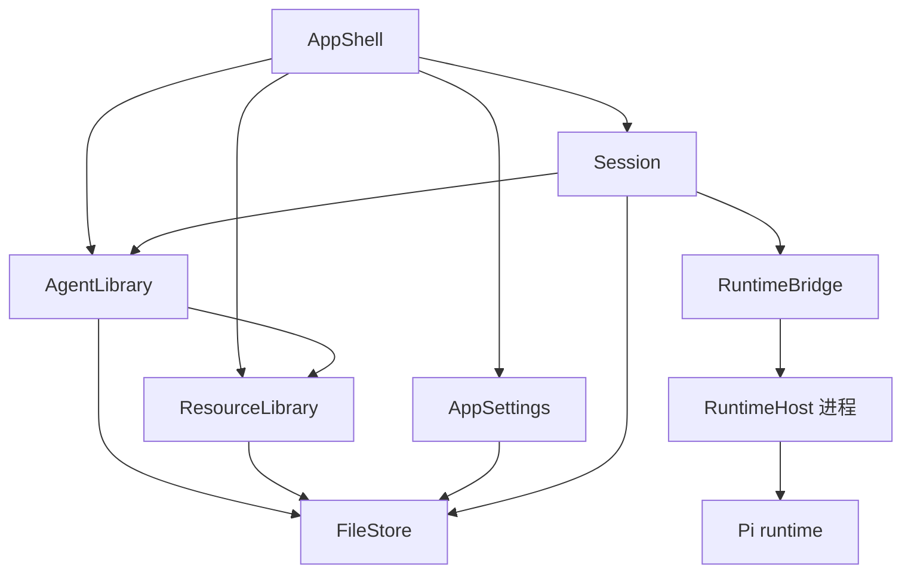

# AgentMac 技术设计

## 架构概览

AgentMac 是一个内置 Node.js 和 Pi runtime 的 SwiftUI macOS 应用。Swift 负责原生应用体验，
Node 负责 Pi 集成。



推荐的 app bundle 形态：

```text
AgentMac.app
├─ SwiftUI App
│  ├─ Agent 管理
│  ├─ 资源库管理
│  ├─ Chat/Session UI
│  └─ 工具确认 UI
│
└─ Embedded Runtime
   ├─ Node.js
   ├─ Pi packages
   └─ Node Runtime Host
```

SwiftUI 和 Node Runtime Host 之间使用一个小的应用私有协议通信，例如基于 stdin/stdout 的
JSONL。这个协议应保持窄接口，避免 Pi 内部变化导致 Swift 侧大面积修改。

## 技术选型与架构约束

### SwiftUI + TCA

AgentMac 的 macOS UI 和应用级状态编排采用 The Composable Architecture（TCA）。

TCA 的使用边界：

- `AppShell` 和各个可见功能页面按 TCA Feature 组织 state、action、reducer 和 effects。
- SwiftUI View 只根据 store 渲染界面，并把用户操作发送为 action。
- Reducer 编排异步 effect，例如加载 Agent、保存资源、启动 session、发送消息和处理 runtime
  事件。
- Feature 通过 TCA dependency 调用 `AgentLibrary`、`ResourceLibrary`、`Session`、
  `RuntimeBridge` 等服务。

不使用 TCA 的位置：

- `FileStore` 保持普通 Swift 文件服务。
- `ResourceLibrary`、`AgentLibrary` 保持普通 Swift 应用服务和领域类型。
- `RuntimeBridge` 保持进程通信边界。
- `RuntimeHost` 是 Node 侧代码，不依赖 Swift/TCA。

原则：TCA 用于 UI 状态和应用流程编排；底层模块通过明确接口提供能力，不直接依赖 TCA。

## 用户数据布局

可变用户数据放在 macOS Application Support 目录下：

```text
~/Library/Application Support/AgentMac/
├─ agents/
│  └─ ecommerce/
│     ├─ agent.yaml
│     └─ system.md
│
├─ library/
│  ├─ knowledge/
│  │  ├─ refund-policy.md
│  │  └─ order-rules.md
│  ├─ skills/
│  │  └─ report-writing/
│  │     ├─ SKILL.md
│  │     └─ references/
│  └─ tools/
│     └─ ticket-search/
│        ├─ tool.yaml
│        └─ index.js
│
├─ sessions/
└─ settings.yaml
```

app bundle 视为只读。用户创建的 Agents、knowledge、skills、tools、sessions、logs、settings
都属于 Application Support。`settings.yaml` 保存 app 级设置，包括数据布局版本、Runtime 使用偏好
以及 Agent 可选择的模型 provider 白名单；Agent 自身定义仍只保存在各自的 `agent.yaml` 中。

## Agent Manifest

每个 Agent 使用一个小的 `agent.yaml` 描述。

示例：

```yaml
id: ecommerce
name: 电商运营助手

model:
  provider: openai
  name: gpt-5-codex

systemPrompt: system.md

knowledge:
  - ../../library/knowledge/refund-policy.md
  - ../../library/knowledge/order-rules.md

skills:
  - ../../library/skills/report-writing

tools:
  - ../../library/tools/ticket-search

permissions:
  bash: ask
  edit: ask
  network: ask
```

Agent 编辑器负责读写这个文件。用户不需要直接编辑 YAML，但后续可以增加高级 raw YAML
编辑器。

## 资源库结构

### Knowledge

knowledge 资源第一版从 Markdown 或纯文本文件开始。

MVP 能力：

- 创建 knowledge 文件。
- 编辑 Markdown 内容。
- 导入本地 text/Markdown 文件。
- 在编辑 Agent 时选择 knowledge 文件。

第一版避免向量检索或复杂索引。先用基础文件选择和上下文加载验证产品即可。

### Skills

skills 使用 Agent Skills 目录约定。

最小结构：

```text
library/skills/<skill-id>/
├─ SKILL.md
└─ references/
```

MVP 能力：

- 创建 skill 目录。
- 编辑 `SKILL.md`。
- 列表和编辑标题优先使用 `SKILL.md` 顶部 YAML frontmatter 的 `name` 字段作为展示名。
- 新增或编辑 references。
- 校验 `SKILL.md` 是否存在。
- 在编辑 Agent 时选择 skills。

### Tools

tools 保持文件化和显式声明。

最小结构：

```text
library/tools/<tool-id>/
├─ tool.yaml
└─ index.js
```

MVP 能力：

- 创建 tool 目录。
- 编辑 `tool.yaml`。
- 编辑 tool 入口文件。
- 在编辑 Agent 时选择 tools。
- 在高风险工具执行前通过 `Approval` 请求用户确认。

## Runtime Host 职责

Node Runtime Host 是 SwiftUI 和 Pi 之间的桥。

它应该：

- 接收 Swift 传入的固定 Pi coding agent 模式，或接收可配置 Agent 阶段传入的
  `ResolvedAgentConfig`。
- 在 `ResolvedAgentConfig` 模式下读取 system prompt、knowledge、skills、tools 绝对路径。
- 启动和管理 Pi sessions。
- 将 Pi events 流式转发给 SwiftUI。
- 将 Pi toolcall 和工具执行阶段的非文本进度转成 `runtimeActivity`，作为 Swift 侧空闲等待心跳。
- 遇到工具审批请求时上报 `toolApprovalRequested`，等待 Swift 侧通过 `approveToolCall`
  返回 approved/denied。
- 在用户请求时停止或中断运行中的 session。

当前固定 Pi coding agent 模式由 Runtime Host 直接创建 Pi session：AgentMac 启用 Pi 内建
`read`、`bash`、`edit`、`write` 工具，并通过内联 Pi extension 在工具执行前接入
`toolApprovalRequested` / `approveToolCall` 审批流；同时关闭外部 Pi extensions、skills、
prompt templates、themes 和 context files 加载。默认 `coding-agent` 因此不读取 AgentLibrary
的资源；权限字段仍由当前固定模式的审批流解释，默认编辑页不暴露这些字段。

SwiftUI 应通过一组小命令调用 Runtime Host：

```text
ping
startSession
sendMessage
approveToolCall
abortSession
```

基础 chat session 阶段允许 `startSession` 使用固定 Pi coding agent 模式。该模式只用于验证
SwiftUI -> RuntimeBridge -> RuntimeHost -> Pi 的主链路，不读取用户 `agent.yaml`，也不加载
用户选择的 knowledge、skills、tools。可配置 Agent 阶段应改为由 `AgentLibrary` 生成
`ResolvedAgentConfig` 后传给 Runtime Host。

## 模块划分

第一版保持简单的模块结构。这些模块可以先作为主 macOS app target 内部的文件夹存在，
不需要一开始拆成独立 Xcode target。等代码规模增长后再考虑拆 target。

```text
AgentMac/
├─ AppShell/
├─ FileStore/
├─ AppSettings/
├─ AgentLibrary/
├─ ResourceLibrary/
├─ Session/
├─ RuntimeBridge/
├─ Approval/          # 基础 chat session 跑通后再实现
└─ RuntimeHost/
```

### AppShell

`AppShell` 负责可见的 macOS 应用外壳。

职责：

- 应用启动和根视图组合。
- 首次启动时初始化 Application Support 数据目录。
- 窗口布局和导航。
- 主窗口默认承载面向 Agent 使用场景的会话工作台。
- 通过管理入口打开独立的 Agent Library 和 Resource Library 窗口。
- 持有应用级 UI 状态，例如当前选择的 Agent、workspace 和当前会话。
- 将 UI 操作连接到底层应用服务。

不负责：

- 直接解析 `agent.yaml`。
- 直接读写资源文件。
- 了解 Pi runtime 细节。
- 执行工具。

`AppShell` 应依赖 `AgentLibrary`、`ResourceLibrary`、`AppSettings`、`Session` 等较高层 Swift
服务，而不是依赖低层文件或 runtime 细节。

当前文件划分：

- `AgentMacApp.swift`：声明主窗口、Agent Library 窗口、Resource Library 窗口和 Settings 窗口。
- `AppFeature.swift`：根 TCA Feature，组合固定 coding agent 会话页面，并编排首次启动初始化。
- `AppView.swift`：根视图、启动错误提示、会话工作台、管理窗口和 Settings 入口 SwiftUI 渲染。
- `AppStartupClient.swift`：启动初始化的 TCA dependency 边界。live 实现内部初始化 `FileStore`，
  并在缺失时创建默认 `coding-agent`。该默认 Agent 表示当前内置的 Pi coding agent；reducer 和
  SwiftUI View 只依赖该 dependency。默认 `coding-agent` 的提示词、资源和权限由 Pi coding
  agent 当前运行模式管理，Agent 编辑页只暴露模型 provider/name 配置。
- `AgentFeature.swift`：Agent 管理页面 state、action、reducer 和异步 effect 编排。
- `AgentView.swift`：Agent 列表、创建表单和编辑表单 SwiftUI 渲染。
- `AppAgentClient.swift`：Agent 管理的 TCA dependency 边界。live 实现内部调用
  `AgentLibrary`，reducer 和 SwiftUI View 只依赖该 dependency。
- `SettingsFeature.swift`：Settings 页面 state、action、reducer 和异步 effect 编排。
- `SettingsView.swift`：Agent 模型 provider 白名单设置 SwiftUI 渲染。
- `AppSettingsClient.swift`：Settings 的 TCA dependency 边界。live 实现内部调用 `AppSettings`，
  reducer 和 SwiftUI View 只依赖该 dependency。
- `ResourceFeature.swift`：Resource 管理页面 state、action、reducer 和异步 effect 编排。
- `ResourceView.swift`：Resource 类型切换、列表、创建表单和编辑表单 SwiftUI 渲染。
- `AppResourceClient.swift`：Resource 管理的 TCA dependency 边界。live 实现内部调用
  `ResourceLibrary`，reducer 和 SwiftUI View 只依赖该 dependency。
- `SessionFeature.swift`：会话页面 state、action、reducer 和异步 effect 编排。
- `AppSessionClient.swift`：AppShell 的 TCA dependency 边界。live 实现内部组合
  `FileStore`、`RuntimeBridge` 和 `ChatSessionManager` 来创建固定 coding agent session；
  reducer 和 SwiftUI View 只依赖该 dependency，不直接持有底层服务。

主窗口当前默认显示会话工作台，Agent 管理和 Resource 管理从 toolbar 入口以独立窗口打开。
Agent 管理当前支持列表、创建、选中加载、编辑名称、从 Settings 白名单选择模型 provider、
编辑模型 name、编辑 system prompt、选择 knowledge/skills/tools 和保存；其中默认 `coding-agent` 只展示并保存模型配置，
不展示 Pi coding agent 自身管理的名称、system prompt、资源和权限字段。Resource 管理当前支持
knowledge、skill 和 tool 的列表、创建、纯文本编辑和保存，
并支持 knowledge 改名、保存成功提示和删除当前选中的 knowledge、skill、tool。
其中 knowledge、skill 和 tool 创建由 AppShell 自动生成未占用 ID，创建表单不暴露 ID 输入；tool
使用 `tool`、`tool-2`、`tool-3` 序列，展示名称和配置一起在 `tool.yaml` 中编辑；skill 导入由
AppShell 选择本地目录，并通过 `AppResourceClient` 生成基于源目录名的未占用 ID 后交给
`ResourceLibrary` 复制。Agent 编辑页通过 `AppResourceClient` 加载共享资源，并把选择结果保存为
相对 `agent.yaml` 的 `../../library/...` 引用。工具审批确认 UI 已通过会话页面接入；可配置
Agent session 后续再接入。

### AppSettings

`AppSettings` 负责 app 级 `settings.yaml` 的模型、轻量 YAML 编解码和读写边界，并维护 Settings
页面使用的 Pi provider 目录和 `Pi/auth.json` API Key 存储边界。

职责：

- 读取和保存 `settings.yaml`。
- 为旧版或缺失字段的 settings 提供默认值。
- 保存 Runtime 使用偏好和 Agent 可选择的模型 provider 白名单。
- 定义当前内置 Pi 版本下支持展示的模型 provider。
- 读取、写入和删除 Pi `auth.json` 中的 API Key 凭据状态，并保留其它凭据条目。

不负责：

- 解析或保存 `agent.yaml`。
- 创建或刷新 OAuth/订阅授权。
- 决定具体模型名称或 RuntimeHost 启动参数。
- 持有 SwiftUI/TCA 状态。

`AppSettings` 使用 `FileStore` 访问磁盘。`AppShell` 通过 `AppSettingsClient` 和
`AppProviderAuthClient` 这两个 TCA dependency 调用它，SwiftUI View 不直接持有 `AppSettingsStore`、
`PiAuthStore` 或 `FileStore`。

### FileStore

`FileStore` 是 Swift 侧唯一理解 Application Support 磁盘布局的模块。

职责：

- 创建应用数据目录。
- 创建 `agents/`、`library/`、`sessions/` 等必要目录。
- 读写文本文件。
- 读写 YAML 文件。
- 解析 app 数据目录下的安全文件路径。
- 列出 Agent 目录和资源库目录。
- 将外部目录复制到 app 数据目录内的安全目标路径。
- 删除 app 数据目录内的目录型资源子树。

不负责：

- 决定 Agent 的业务含义。
- 导入、解析或校验资源库业务对象。
- 判断工具是否安全。
- 启动 session。
- 与 Pi 通信。
- 持有 UI 状态。

`FileStore` 应提供稳定、朴素的文件操作。更高层模块决定这些文件代表什么。

### AgentLibrary

`AgentLibrary` 负责 Agent 定义。

职责：

- 创建新的 Agent 目录。
- 创建初始 `agent.yaml`。
- 创建 Agent 私有的 `system.md`。
- 从磁盘加载 Agent。
- 保存 Agent 编辑。
- 更新 Agent 选择的 knowledge、skills、tools。
- 在 session 启动前校验 Agent manifest。
- 将 Agent 解析成 runtime 可用的 `ResolvedAgentConfig`。

校验内容包括：

- Agent ID 存在且路径安全。
- `agent.yaml` 存在。
- `system.md` 存在。
- 已选择的 knowledge 文件存在。
- 已选择的 skill 目录包含 `SKILL.md`。
- 已选择的 tool 目录包含 `tool.yaml`，且 `tool.yaml.entry` 指向的入口文件存在。
- 权限配置合法。

不负责：

- 直接编辑共享 knowledge、skills、tools。
- 渲染聊天 UI。
- 启动 Node 或 Pi。
- 执行工具。

`AgentLibrary` 使用 `FileStore` 访问磁盘，并沿用 `ResourceLibrary` 拥有的资源分类和最小结构
规则。共享资源的独立维护和可选列表由 `ResourceLibrary` 提供；`AgentLibrary` 只保存引用并
在校验时检查这些引用能否
解析到有效文件结构。

当前文件划分：

- `AgentModels.swift`：Agent manifest、编辑模型、权限和运行时配置类型。
- `AgentErrors.swift`：Agent 校验和服务错误。
- `AgentManifestYAMLCodec.swift`：第一版 `agent.yaml` 最小 YAML 编解码。
- `AgentLibrary.swift`：Agent 服务入口、路径解析和校验流程。

### ResourceLibrary

`ResourceLibrary` 负责共享可复用资源。

职责：

- 列出 knowledge 文件。
- 创建和编辑 knowledge 文件。
- 删除和改名 knowledge 文件。
- 列出 skill 目录。
- 创建和编辑 skill 目录。
- 导入已有 skill 目录。
- 删除已有 skill 目录。
- 检查 skill 是否满足最小结构。
- 列出 tool 目录。
- 创建和编辑 tool 目录。
- 删除已有 tool 目录。
- 检查 tool 是否满足最小结构。
- 为 Agent 编辑器提供可选择资源。

MVP 资源规则：

- knowledge 从 Markdown 或纯文本文件开始。
- skills 是至少包含 `SKILL.md` 的目录。
- 导入 skill 时源目录顶层必须包含 `SKILL.md`，导入结果保存为 `library/skills/<skill-id>/`，
  子目录内容原样保留。
- tools 是包含 `tool.yaml`，且 `tool.yaml.entry` 指向的入口文件存在的目录；默认入口文件
  是 `index.js`。

不负责：

- 决定某个 Agent 使用哪些资源。
- 启动或管理 session。
- 执行 tool 代码。
- 存储资源版本或发布状态。

`ResourceLibrary` 让资源可以独立维护。`AgentLibrary` 负责将这些资源组合进 Agent。

当前文件划分：

- `ResourceModels.swift`：资源类型、资源描述和校验结果。
- `ResourceLibrary.swift`：资源服务入口、共享目录常量、ID 校验和路径 helper。
- `ResourceLibrary+Knowledge.swift`：knowledge 文件维护。
- `ResourceLibrary+Skill.swift`：skill 目录和 `SKILL.md` 维护。
- `ResourceLibrary+Tool.swift`：tool 目录、`tool.yaml` 和入口文件维护。

### Session

`Session` 负责运行中或可恢复的 Agent 对话。

职责：

- 基于 Agent 和 workspace 创建 session。
- 发送用户消息。
- 接收流式 assistant 输出。
- 跟踪 message 状态。
- 第一阶段跟踪 runtime 状态，例如 idle、running、failed、aborted。
- 拒绝重复 start、未完成 send 期间的再次 send，以及 failed/aborted 后的隐式复用。
- 将完整 session 记录保存到 `sessions/` 下。
- 创建、加载、缓存、列出和删除 session。
- 调用 `RuntimeBridge` 与 Node Runtime Host 通信。

不负责：

- 直接解析 Agent manifests。
- 编辑 knowledge、skills、tools。
- 直接实现 Pi 协议细节。
- 绕过 `FileStore` 决定低层文件路径。

`Session` 是活动工作的编排层。它应该接收来自 `AgentLibrary` 的、已经校验过的
`ResolvedAgentConfig`，再通过 `RuntimeBridge` 运行。

冷启动恢复时，`Session` 只能恢复本地消息和状态；`RuntimeBridge` 当前不支持重新附着旧
Runtime Host session。因此旧 record 中的 `runtimeSessionID` 只用于诊断，恢复到 running 的
record 应降级为 failed。

### RuntimeBridge

`RuntimeBridge` 负责 Swift 侧本地 runtime 进程边界。

职责：

- 定位内置 Node 可执行文件。
- 定位内置 Runtime Host 脚本。
- 启动和停止 Runtime Host 进程。
- 向 Runtime Host 发送 JSONL commands。
- 从 Runtime Host 读取 JSONL events。
- 将 runtime events 映射成 `RuntimeBridge` 自己定义的 Swift 类型。
- 上报进程失败和 runtime 诊断信息。

不负责：

- 了解 Agent 编辑 UI 细节。
- 决定启用哪些 tools。
- 解析 `SKILL.md`。
- 包含 Pi SDK 代码。
- 自己执行工具审批结果。

这个模块应该是一个窄桥接层，让 Swift app 与 Node/Pi runtime 的变化隔离。

### Approval

`Approval` 负责用户确认和权限判断。基础 chat session 跑通后，第一版 Approval 闭环通过
`toolApprovalRequested`、`ChatSessionSnapshot.pendingToolApprovalRequest` 和 `approveToolCall`
连接 RuntimeHost、Session 与 AppShell。

职责：

- 根据 Agent 权限策略评估 tool request。
- 判断请求可以自动运行、必须询问用户，还是必须拒绝。
- 通过 `AppShell` 在 UI 中展示审批请求。
- 将审批结果返回给 `Session`。
- 记录足够的审批信息以便诊断。

典型审批场景：

- shell 命令执行。
- 文件编辑。
- 写入 selected workspace 之外的文件。
- 网络访问。
- 需要 secrets 的 tool request。

不负责：

- 直接执行已批准的动作。
- 解析 Agent manifests。
- 持有 Runtime Host 进程。
- 编辑资源。

关键规则是：工具执行留在 runtime 中，审批策略和用户确认留在可见的 app UI 中。

第一版策略：

- `ToolApprovalRequest`、`ToolApprovalDecision`、`ApprovalService` 和 `ToolApprovalHandling`
  放在 `Approval` 模块。
- `ApprovalService` 根据 `ResolvedAgentConfig.permissions` 解释 allow/ask/deny。
- allow 直接由 `Session` 回传 `approved`。
- deny 直接由 `Session` 回传 `denied`。
- ask 下 Pi 内建 `read`、`edit`、`write` 的文件类请求默认允许；`bash` 的 shell 请求在命令不匹配常见文件删除语义时默认允许。
- 其余 ask 请求通过 `ChatSessionSnapshot.pendingToolApprovalRequest` 暴露给 AppShell；AppShell/TCA
  展示确认 UI，并通过 `AppSessionClient` 提交用户决策。匹配文件删除语义的 `bash` 仍进入交互审批。
- `ToolApprovalHandling` 不能依赖 TCA。live AppShell 使用 `InteractiveToolApprovalHandler`
  将 UI 决策交回正在等待的 Session。
- 用户关闭审批 UI 时按 denied 处理。

### RuntimeHost

`RuntimeHost` 是内置的 Node 侧集成层。

职责：

- 通过 JSONL 接收 Swift 命令。
- 加载 Pi。
- 启动 Pi sessions。
- 将 Pi events 转发给 Swift。
- 在 Pi toolcall 和工具执行阶段输出 `runtimeActivity`，避免长时间无 assistant 文本时触发误超时。
- 遇到工具审批请求时输出 `toolApprovalRequested`，等待 Swift 通过 `approveToolCall` 返回
  `approved` 或 `denied`。
- 用 Swift 友好的事件格式返回错误和诊断信息。

第一阶段 RuntimeHost 只支持固定 `fixedCodingAgent` session mode，用于验证
SwiftUI -> RuntimeBridge -> RuntimeHost -> Pi 主链路。该模式不读取用户 `agent.yaml`，不加载
用户选择的 knowledge、skills、tools；Runtime Host 只启用 Pi 内建 `read`、`bash`、`edit`、
`write` 工具，并禁用外部 Pi extensions、skills、prompt templates、themes 和项目 context
files。

后续可配置 Agent 阶段再支持 `resolved` mode，接收 Swift 侧 `AgentLibrary` 生成的
`ResolvedAgentConfig`，并读取其中的 system prompt、knowledge、skills、tools 绝对路径。

不负责：

- macOS UI。
- 存储长期 Agent 定义。
- 读取或保存 `agent.yaml`。
- 解析 Agent 资源相对路径。
- 除非通过明确 app command 请求，否则不修改共享资源。
- 依赖 app bundle 内文件可写。

app bundle 应包含 Runtime Host 代码和内置 Pi runtime。可变用户数据留在 Application Support。

## 模块依赖规则

依赖应该指向更简单的模块，并通过明确边界连接 runtime。

第一版不单独创建 `CoreModels` 模块。类型应放在最贴近职责的模块中：

- `AgentManifest`、`ModelConfig`、`PermissionConfig`、`ResolvedAgentConfig` 放在
  `AgentLibrary`。
- `KnowledgeResource`、`SkillResource`、`ToolResource` 放在 `ResourceLibrary`。
- `RuntimeCommand`、`RuntimeEvent`、`RuntimeError` 放在 `RuntimeBridge`。
- `ChatSession`、`ChatMessage`、`SessionState` 放在 `Session`。
- `ChatSessionRecord`、`SessionStore`、`ChatSessionManager` 放在 `Session`。
- `ToolApprovalRequest`、`ToolApprovalDecision`、`ToolApprovalHandling`、`ApprovalService`
  放在 `Approval`。
- `AppSettings`、`RuntimeSettings`、`AgentAppSettings` 和 `AppSettingsStore` 放在
  `AppSettings`。
- `PermissionConfig` 表示 Agent 中保存的权限配置，放在 `AgentLibrary`。
- `ApprovalService` 解释 `PermissionConfig`，运行时执行仍由 RuntimeHost 负责。
- `AppDataLayout`、`FileStoreError` 和安全相对路径解析能力放在 `FileStore`。

原则：谁产生和维护这个数据结构，类型就放在谁那里；谁只是使用它，就依赖拥有它的模块。



文本形式：

```text
AppShell
  -> AgentLibrary
  -> ResourceLibrary
  -> AppSettings
  -> Session

AppSettings
  -> FileStore

AgentLibrary
  -> FileStore
  -> ResourceLibrary

ResourceLibrary
  -> FileStore

Session
  -> AgentLibrary
  -> FileStore
  -> RuntimeBridge

RuntimeBridge
  -> RuntimeHost process

FileStore
  -> no project modules

RuntimeHost
  -> Pi runtime
```

`Approval` 实现后，当前依赖还包括：

```text
AppShell
  -> Approval

Session
  -> Approval

Approval
  -> AgentLibrary
```

避免反向依赖：

- `FileStore` 不应了解 SwiftUI 或 Pi。
- `AppSettings` 不应了解 SwiftUI、TCA、AgentLibrary 或 RuntimeHost。
- `RuntimeBridge` 不应了解资源如何被编辑。
- `ResourceLibrary` 不应启动 session。
- `RuntimeHost` 不应成为 Agent 定义的事实来源。

## 实施顺序

1. 实现 `FileStore`，建立 Application Support 目录和基础文件读写能力。
2. 实现 `ResourceLibrary`，能列出和校验 knowledge、skills、tools。
3. 实现 `AgentLibrary`，能创建、加载、保存并校验 Agent。
4. 将 Node.js 和 Pi 打包进 macOS 应用。
5. 构建最小 Node Runtime Host，并从 Swift 启动它。
6. 加载一个固定的 Pi coding agent 配置。
7. 从 macOS UI 跑通固定 Pi coding agent 的基础 chat session。
   校验：用户可以在 macOS UI 中发送一条消息，Runtime Host 能启动 Pi coding agent，
   assistant 回复能流式展示在 UI 中。
8. 加载一个固定的 `agent.yaml` 和 `system.md`。
9. 增加 Agent 编辑 UI。
10. 增加 knowledge、skills、tools 资源库 UI。
11. 在 Agent 编辑器中增加资源选择。
12. 增加 session 持久化和基础诊断。
13. 增加 `Approval` 模块和 tool approval UI。
    校验：当 runtime 返回工具审批请求时，UI 能展示请求；用户批准后继续执行，拒绝后向
    runtime 返回 denied。
